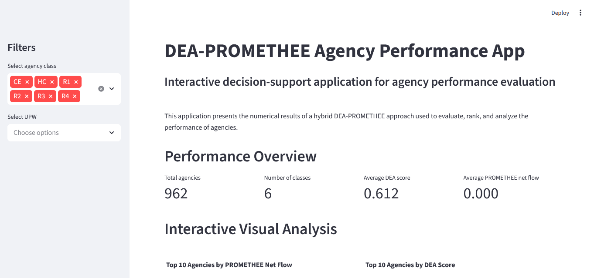
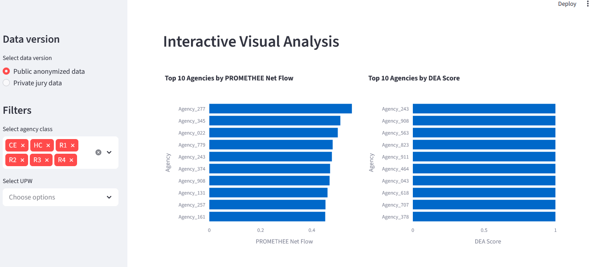
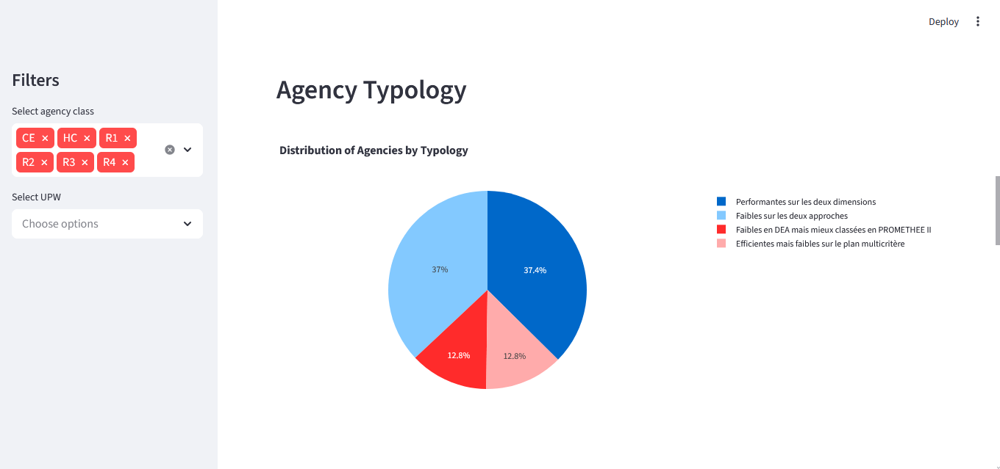

# DEA-PROMETHEE Agency Performance App

## Project Overview

This project presents an interactive Streamlit application for agency performance evaluation using a hybrid DEA-PROMETHEE approach.

The application is based on numerical results from a multicriteria performance evaluation study. It allows users to explore DEA rankings, PROMETHEE rankings, final agency typology, and interactive visualizations.
## Data Confidentiality

For confidentiality reasons, agency names were anonymized in the public version of this project.

The public version does not display the real agency names. Instead, each agency is represented using its UPW name followed by an anonymous number, such as `DJELFA 01`, `DJELFA 02`, or `SETIF 01`.

The private version with real agency names is kept locally for academic presentation purposes and is not included in the public GitHub repository.

## Objective

The main objective of this project is to transform DEA-PROMETHEE performance results into an interactive decision-support tool.

The application helps decision-makers:

- analyze agency performance;
- compare DEA and PROMETHEE rankings;
- identify top-performing agencies;
- explore agency typologies;
- filter results by agency class and UPW;
- download filtered results.

## Methodology

The project is based on a hybrid approach combining:

- **DEA**: Data Envelopment Analysis, used to evaluate technical efficiency;
- **PROMETHEE II**: a multicriteria decision-making method used to rank agencies based on preference flows;
- **Agency segmentation**: used to compare agencies within homogeneous classes;
- **Final typology**: used to classify agencies according to both DEA and PROMETHEE results.

## Application Features

The Streamlit application includes:

- interactive filters by agency class;
- interactive filters by UPW;
- global KPIs;
- Top 10 agencies by PROMETHEE net flow;
- Top 10 agencies by DEA score;
- distribution of DEA scores;
- distribution of PROMETHEE net flows;
- agency typology visualization;
- DEA vs PROMETHEE ranking comparison;
- detailed data tables;
- downloadable filtered results.

## Dashboard Preview

### App Overview



### Top Rankings



### Typology Analysis



### DEA vs PROMETHEE Ranking Comparison


## Project Structure

```text
dea-promethee-agency-performance-app/
│
├── data/
│   ├── annexe_2_classement_complet_dea.csv
│   ├── annexe_3_classement_complet_promethee.csv
│   └── annexe_4_typologie_finale_dea_promethee.csv
│
├── screenshots/
│   ├── app_overview.png
│   ├── top_rankings.png
│   ├── typology_analysis.png
│   └── ranking_comparison.png
│
├── app.py
├── README.md
└── requirements.txt
Tools Used
Python
Streamlit
Pandas
Plotly
Matplotlib
Key Insights

The application highlights the differences and complementarities between DEA and PROMETHEE results.

DEA identifies technically efficient agencies, while PROMETHEE provides a multicriteria ranking based on preference flows.

The final typology helps distinguish between agencies that are globally high-performing, agencies that require improvement, and agencies with mixed performance profiles.

Author

Chanez Benidir

Interested in statistical modeling, multicriteria decision analysis, machine learning, business analytics, and decision-support systems.
```text
